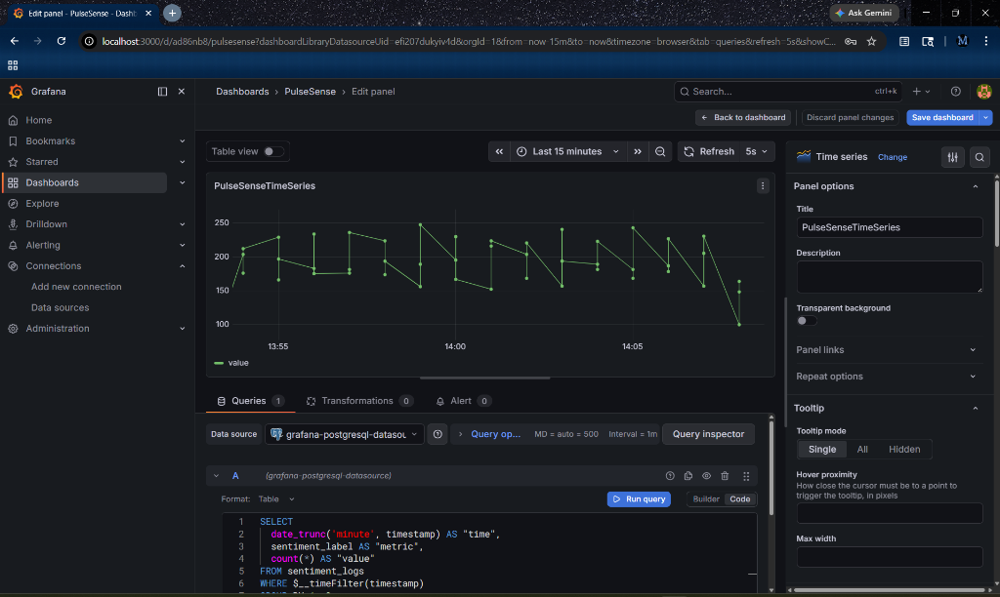
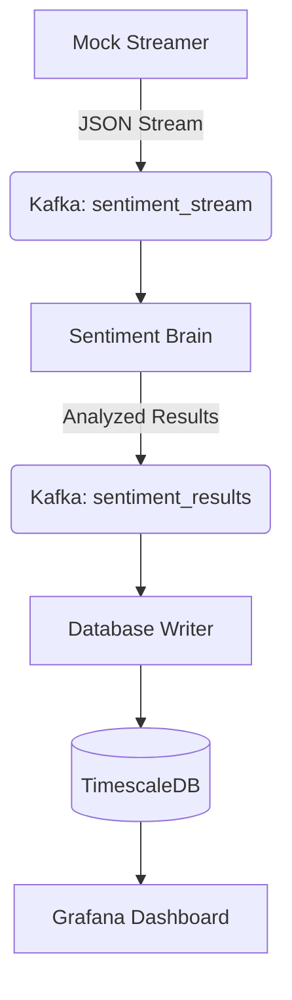

# PulseSense: Real-Time Big Data Sentiment Analytics 🚀

PulseSense is a modular, high-velocity sentiment analysis platform that transforms raw data streams into live, actionable intelligence. It leverages **Apache Kafka** for orchestration, **NLTK (VADER)** for NLP intelligence, and **TimescaleDB** for high-performance time-series persistence.



## 🏗️ Architecture: The 3-Layer System

The platform is built on a resilient, decoupled architecture that allows each component to scale independently.



### 1. Ingestion Layer (The Heartbeat)
A high-velocity simulation engine generating thousands of messages per minute.
- **Tech Stack**: Python, `kafka-python-ng`.
- **Target**: Kafka Topic `sentiment_stream`.

### 2. Processing Layer (The Brain)
A real-time NLP engine that labels every incoming message with a sentiment polarity.
- **Tech Stack**: NLTK, VADER Lexicon.
- **Resilience**: Self-healing with automatic dependency installation.

### 3. Persistence & Vision Layer
A high-speed writer that batches intelligence for the dashboard.
- **Tech Stack**: TimescaleDB (PostgreSQL-based), Grafana.
- **Storage**: TimescaleDB Hypertables for optimized time-series queries.

---

## 🚀 Quick Start

### 1. Launch Infrastructure
Ensure you have Docker and Docker Compose installed.
```bash
docker-compose up -d
```

### 2. Install Dependencies
```bash
python -m venv .venv
source .venv/bin/activate  # On Windows: .venv\Scripts\activate
pip install -r requirements.txt
```

### 3. Start the Pipeline
Run each of these in a separate terminal:
```bash
python execution/ingestion/mock_streamer.py
python execution/processing/sentiment_engine.py
python execution/persistence/db_writer.py
```

### 4. Open the Dashboard
- **URL**: `http://localhost:3000`
- **Login**: `admin` / `admin_pulse_secure`

---

## 🔬 Performance & Accuracy
During internal benchmarking, the VADER-based engine achieved an accuracy rate of **~80%**, excelling at clear sentiment detection while identifying sarcasm as a primary area for future LLM-based improvements.

## 🛡️ License
Distributed under the MIT License. See `LICENSE` for more information.

---
**PulseSense: Hear the World's Heartbeat in Real-Time.**
